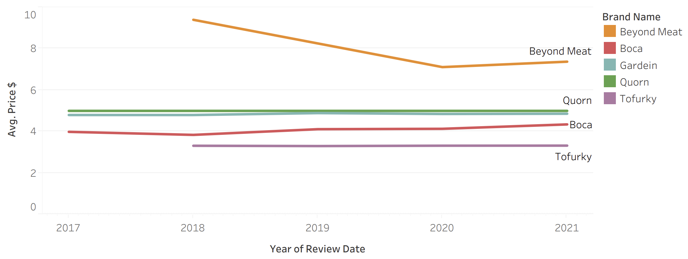
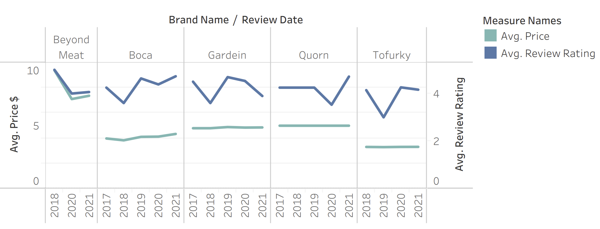

# Project One - Artificial Meat Review Predictions

### Group Three Members 
 - Tamar Brand-Perez
 - Tiffany Price
 - Ben Tubbs
 - Jose Santos

## Topic

The topic of our project involves artificial meat review predictions.  

## The Why

We selected this topic because the artificial meat industry is becoming increasingly popular as of late.  We find it the industry very interesting and want to understand how consumer experience and resulting reviews can predict ratings. After pulling and cleaning our data set from Amazon, we used the Natural Language Processing machine learning model to train a sentiment classifier. During the cleaning process, both five and one star reviews will be maintained, while two, three and four star ratings will be removed.  Next, we will pull reviews without ratings and direct the machine to predict the ratings based on the analysis of the reviews.  

## Source Data

Our data set was pulled from the Amazon Grocery and Gourmet Food section (http://deepyeti.ucsd.edu/jianmo/amazon/index.html).  We scraped Amazon's website to pull reviews and ratings for our visualization. 

## Goals

In this project we will use a Natural Language Processing machine learning model to train a sentiment classifier on an Amazon dataset of Grocery and Gourmet Food reviews (https://jmcauley.ucsd.edu/data/amazon/) containing over 1 million reviews.  

The goal of this classifier is to predict user sentiment (positive or negative) for fake meat products.  Upon having ratings predicted based on the reviews through NLP, We believe this analysis will help store owners identify which fake meat brands to sell. Having access to a model to predict ratings will allow the stakeholder to understand how reviews affect ratings and, in turn, impact future sales of fake meat products.

## Database NEED TO ADD SCREEN SHOTS AND COMPLETE SECTION

Link to Google doc:

groceries_trimmed.csv:

https://drive.google.com/file/d/1RrqXXbHTOJ8rPADNauFVRPBzMXwekjYP/view?usp=sharing

The mockup database format for now is:

columns:

index, overall, reviewText

the overall is the rating number between one and five. We are focusing on 1 and 5 only. The review Text is the review content that we will analyze using NLP.

## Algorithm

The algorithm uses a bag of words model and a Naive Bayes classifier.  

### Preprocessing and Normalization

The following preprocessing and normalization steps were taken before creating the labeled data set.  Each is explained in greater detail below.

* Tokenized
* Converted to Lowercase
* Removed Non Alphanumerics
* Removed Items Less Than Two Characters
* Removed Stop Words
* Lemmatized

The data was tokenized which means that each sentence was divided into a Python list where the entries are each of the items in the sentence.  Items meaning words that are split smartly so that words such as Mr. are kept together, but periods at the end of the sentence are treated as their own item.  
  
Everything was converted to lowercase.  
  
Everything that was not an alphanumeric was removed leaving only numbers and letters.  
  
All tokens that were less than two characters in length were removed.  
  
Stop words are words such as "in", "for", "that", and "the" which do not add a lot of meaning to the text.  Stop words were also removed.  
  
The words were them lemmatized which means that the same words of different forms were normalized to the same form.  An example of this would be words like "eat", "eats", "ate" and "eaten" are all normalzed to "eat".

### Feature Set

After we have our set of normalized words, we had to create our labeled data set to feed in the algorithm.  Each of the reviews was converted into a Python dictionary with words as the keys and boolean values of as the values.  The keys of the dictionary was the entire feature set which consisted of the 3000 most common words found in all of the reviews.  The boolean values were set to True if the review contained that word and False otherwise.  
  
Next, we shuffled the positive reviews and created a list of 1000 positive and 1000 negative reviews which was again shuffled.  This list of 2000 reviews which is each a hashmap of presence or absence in each individual review of the 3000 most common words in all of the reviews is the feature set that was used to train the model.  Note that this "bag of words" model does not take into consideration word order.

### Machine Learning

A Naive Bayes classifier was used to train the model.  The Bayes model works on the equation P(A | B) = P(B | A) * P(A) / P(B).  The algorithm works by taking in the labeled data and slowly moving each of the words more positive if the word appears in a positive review and more negative if the word appears in a negative review.  At the end of this training, the alogrithm is left with percentages for how positive or negative each word is.  
  
We then make our naive assumption.  Rather than calculating the full review text, we calculate each of the words in the review and multiply the probabilities together.  For example, rather than caluclating P(fake meat is disgusting | Positive) we would calculate P(fake | Positive) * P(meat | Positive) * P(disgusting | Positive) (Stop word removed).  We do the same for the negative probability and then decide which is larger.  This is how the algorithm classifies reviews.

### Interactive Website/Dashboard

LINK WEBSITE OR ADD SCREENSHOTS ESPECIALLY OF INTERACTIVE PORTIONS

## Visualizations
### Price v. Year

### Rating v. Year

### Review v. Price per Year by Brand

## Presentation
A copy of the draft slides has been uploaded to our repository.  You can also link to the presentation here ADD LINK

## Dashboard

The dashboard consists of eight pages that demostrate the work that we have put into this project.  These pages include:

* Project
* Database
* Machine Learning Model
* Amazon Review Scraper
* Reddit Thread Scraper
* Review Classsifier
* Visualizations
* Presentation

### Project Page

The project page gives and overview of the project, the questions to be answered, and the goals of the project.

### Database Page

The database page includes information about where the data was collected from as well as how it was stored in the database.

### Machine Learning Model

The machine learning page includes information about the preprocessing of the data, the featureset creation, the training of the model, and the way in which the model predicts information.  This is the first page with an interactive feature which allows the user to use an alternate sample to train the model.  All of the tables on this page as well as the accuracy will be updated dynamically based upon the new sample of data.

### Amazon Review Scraper

This page allows the user to enter an Amazon product page and then it will scrape some information about the product such as the title and price as well as the first few pages of reviews.  The reviews will also be classified by the algorithm and the classification displayed in a table.

### Reddit Thread Scraper

This page allows the user to enter a Reddit thread.  The comments will be scraped from the thread and classified by the alogrithm.  Statistics are then calculated about the thread such as the number of reviews, the number of positive and negative reviews as well as the percentage of positive and negative reviews.

### Review classifier

The next page allows the user to enter in any text that he or she would like and the algoirthm will classify it and display the text as well as the classification.

### Visualizations

The next page contains an interactive image carousel of several of the visualizations that we created throughout the completion of the project.

### Presentation

The final page shows the presentation, and it is downloadable as a PDF or PPTX document.

### Conclusion
#### Results
In conclusion, our hope is to facilitate increased sales of artificial meat products by way of empowering store owners in their decision making process of which products/brands to sell.  Our ML model predicts the sentiment of user entered reviews with approximately 82% accuracy.  We have seen a range of 80-84% depending on which data is used to train the model.

Also, through use of our interactive website, stakeholders have the ability to understand customer sentiment upon testing reviews.
Finally, from the word clouds and the table analysis of the reviews, the stakeholder will be able to associate specific product description words with the respective brand. This allows for a deeper understanding of how customers choose to comment about a specific product and brand. 

#### Limitations
The limitations we experienced during our analysis include:
 - Our time frame was rushed; as were learning about the limitations of our data set, we were already using it. 
 - Since our initial data set was limited, we were not necessarily focused on the best data set available.  We operated with what we had and made the most of it due to time and resource constraints, including but not limited to, computer capacity and also eventually being blocked by Amazon during our web scraping.
 - Finally, the algorithm does not consider the order of words (ie food tastes great v great tasting food).

#### Further Analysis
If we were to continue future analysis, we would:
 - Include more interactive visualizations for the end user.
 - Scrape in a larger data set, as available.
 - Pull in location data of reviews to further enable stakeholders’ insight into consumer sentiment by location. This would allow for more market focused guidance. 

#### Ways to Improve Project
 - We would search for a more accurate algorithm
 - We would have our algorithm consider word order
 - Finally, we would host our website on a server
