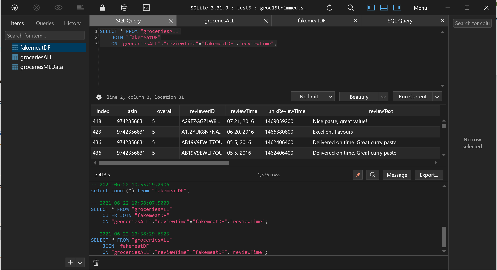

# project-one
A group project

- Created csv for machine learning with 1 and 5 rating trimmed, with the review text, dropped duplicates. This file was then used for the machine learning algorythm. 

- Created a bigger dataframe that included the data to be used for visualizations including time of the reviews, reviewer id, length of the review (number of words) as well as the meta data. For the review length I created a csv from the labeled data, then used a lamda function to count the words in each review. A new column was added with the word count: "review length". For the meta data I used the meta data csv and merged the two dataframes to create one dataframe with all relevant information for visuals. 
The merged dataframes had many Nan's. Dropping them made it clear that there was no overlap between the dataframe of the metadata and the dataframe of the original groceries data. For now, a sqlite database with the groceries data is created without the metadata. 

- Creating database: sqlite and sqlalchemy were used to create a database. Database accessed with python and also using table plus. One of the features of sqlalchemy is ORM=object relational mapper which allows creation of a decoupled system. We can access each class independently without it affecting the other parts of the system. Class = table. Our initial data structure is one table for the visuals and one for the machine learning code as mentioned above. sqlite enables fast retrieval of information that is stored locally. To avoid paying subscription for sharing the database on a server we are using a locally stored database. The speed of retrieval would be particularly important for web applications. For our purpose, using nrows=10 when testing the code was a appropriate for the inital steps. Then the sqlite database was created to allow further manipulations.   
  One part of our project uses dynamic data. That is where you input a review and the machine learning model evaluates it and decides whether it is positive or negative. 

- added a second table to the database for the machine learning model to connect to it instead of using the csv file. Table name: groceriesMLData.

- added a third table that includes the metadata of the reviews: added brand and title to the original data. After an inner join with the original data only 12 rows are left. 

- created a join query on table plus to combine two tables. See image below. 

- the sqlite database was connected to the machine learning algorythm. A subset of the reviews is used from the database to train the machine learning algorythm. 

- An ERD was created to describe the database tables. See image below. 

## Links to the data:
sqlite dataset includes 1 and 5 star ratings: 3 tables one of original groceries data, one of MLdata table and the third includes fakemeat data:
https://drive.google.com/file/d/1QFqJMKHAxnhfl3FOZBy1ZY2wjpn_7YAw/view?usp=sharing

csv file with 1 and 5 star ratings with review text, review length, time, reviewer id:
https://drive.google.com/file/d/1Sp1hZ6GKqPVKF9W2qp3O0rmTO9CSaweB/view?usp=sharing

csv file that includes fakemeat data (12 rows):
https://drive.google.com/file/d/11oMHJFnbUi6OYeQhNKHXaWIkntmyHPl9/view?usp=sharing

## images of database in table plus:

## Image of join query on table plus

## Image of ERD describing database tables - need to add image

database deliverables week 2:
Team members present a fully integrated
database.
✓ Database stores static data for use
during the project ✓ Database interfaces with the project in
some format (e.g., scraping updates the
database, or database connects to the
model) ✓ Includes at least two tables (or
collections, if using MongoDB) ✓ Includes at least one join using the
database language (not including any
joins in Pandas) ✓ Includes at least one connection string
(using SQLAlchemy or PyMongo)
Note: If you use a SQL database, you
must provide your ERD with relationships

